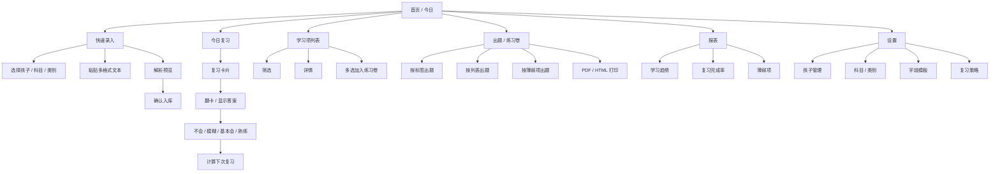
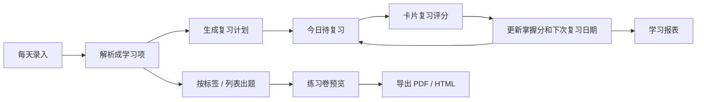
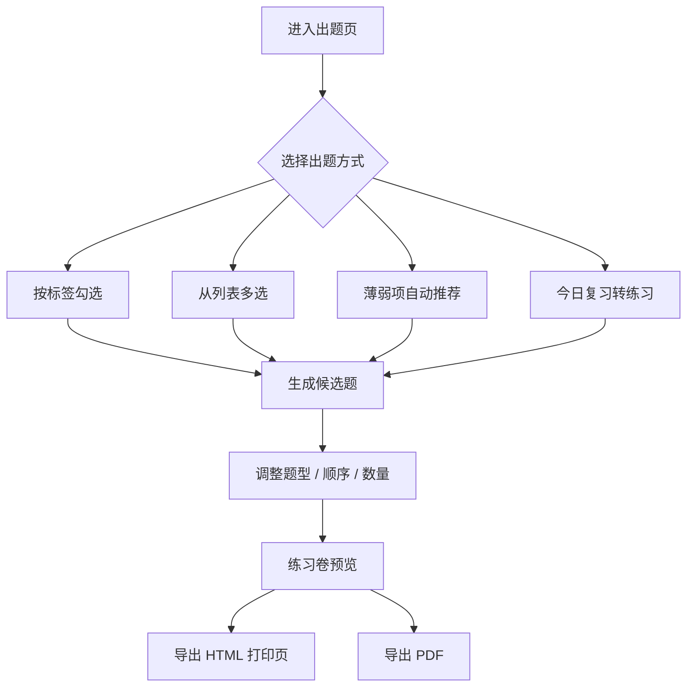
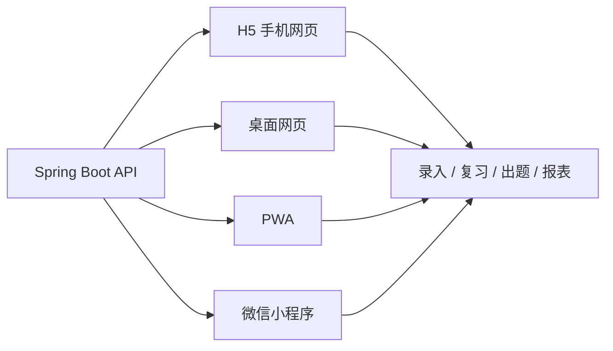

# 孩子学习复习网站设计文档

日期：2026-07-11

## 1. 目标与定位

本项目是一个面向家长日常使用的手机优先学习记录与复习系统。核心目标不是做一个复杂在线教育平台，而是让家长每天能快速录入孩子学习内容，系统自动按照间隔复习逻辑生成待复习任务，并逐步计算每个学习项的掌握程度，后续可以查看学习报表。

典型场景：

- 晚上给孩子录入今天学过的单词、课文、古诗、句子或知识点。
- 第二天或之后打开手机页面，系统自动列出今天该复习的内容。
- 复习时标记“不会 / 模糊 / 基本会 / 熟练”，系统自动调整下次复习时间和掌握度。
- 每周查看学习数量、复习完成率、薄弱项、掌握趋势。

## 2. 可参考的 GitHub / 技术方案

这些项目不建议直接作为业务代码复制，但可以作为算法、模型和工程组织的参考。

### 2.1 Anki

地址：https://github.com/ankitects/anki

Anki 是成熟的间隔重复记忆工具，适合参考“卡片、复习记录、复习调度、掌握反馈”的产品思路。它功能强、生态成熟，但代码体系偏大，不适合作为本项目的直接二次开发基础。

可借鉴：

- 每个学习项可以抽象成“卡片”。
- 复习结果会影响下一次出现时间。
- 复习历史需要长期保存，便于统计和算法优化。

不建议照搬：

- 桌面端和跨端架构过重。
- 功能面远大于家长日常手机录入场景。

### 2.2 open-spaced-repetition / FSRS

地址：https://github.com/open-spaced-repetition/awesome-fsrs

FSRS 是现代间隔重复算法方向，适合后期作为复习算法升级参考。它比固定艾宾浩斯间隔更个性化，但第一版直接实现完整 FSRS 成本偏高。

可借鉴：

- 用稳定性、难度、可回忆概率等指标描述记忆状态。
- 通过每次复习评分动态调整下一次复习时间。

建议：

- MVP 使用“艾宾浩斯固定间隔 + 掌握度修正”的可解释算法。
- 后续在数据积累后，再预留字段升级到 SM-2 / FSRS。

### 2.3 Ebbinghaus_curve

地址：https://github.com/ivakorn/Ebbinghaus_curve

这是一个较小的艾宾浩斯曲线演示项目，包含数据库模型、SQL 查询和按记忆强度计算复习优先级的示例。它不适合作为完整网站基础，但对“如何把复习优先级落到数据库查询”很有参考价值。

可借鉴：

- 学习项保留 `last_review_at`、正确次数、错误次数。
- 查询时按遗忘风险或优先级排序。
- 复习逻辑可以先在服务端计算，不必依赖复杂前端。

### 2.4 Java Spaced Repetition API

参考入口：https://github.com/topics/flashcards?l=java&o=desc&s=forks

GitHub Java flashcards 主题下有一些间隔重复算法实现，例如 Leitner、SM-2、FSRS API。可用于后续对比算法，不建议第一版依赖不活跃的小库作为核心。

可借鉴：

- 把调度算法封装成独立服务或策略类。
- 保持 ReviewResult -> NextSchedule 的输入输出清晰。

### 2.5 Spring Boot + MySQL 工程参考

官方文档：

- Spring Boot SQL / JPA 文档：https://docs.spring.io/spring-boot/reference/data/sql.html
- Spring MySQL 入门：https://spring.io/guides/gs/accessing-data-mysql

建议使用 Spring Boot + Spring MVC + Spring Data JPA 或 MyBatis-Plus + MySQL。若你已有 Java / Spring 经验，后端用 Spring 是合理选择。手机页面可以用 Vue / React，也可以第一版用 Thymeleaf + 少量 JS，但为了后续交互体验，推荐前后端分离。

### 2.6 阿里云部署参考

阿里云 RDS MySQL 产品页：https://www.alibabacloud.com/zh/product/apsaradb-for-rds-mysql

推荐生产部署：

- ECS：部署 Spring Boot 后端、前端静态资源、Nginx。
- RDS MySQL：保存业务数据，避免个人维护数据库备份和容灾。
- OSS：后续如果要上传课文图片、音频、孩子朗读录音，可以放 OSS。

低成本起步：

- 一台 ECS + Docker Compose + MySQL 容器也可以启动。
- 但正式长期使用建议迁移到 RDS，尤其是学习记录这类长期数据。

## 3. 推荐技术架构

### 3.1 MVP 推荐架构

- 前端：Vue 3 + Vite + TypeScript，手机优先响应式页面。
- UI：Vant 或 Naive UI Mobile 风格组件，优先选择移动端表单体验好的组件库。
- 后端：Spring Boot 3.x。
- ORM：MyBatis-Plus 或 Spring Data JPA。
- 数据库：MySQL 8。
- 认证：第一版可以账号密码 + JWT；如果只有家里自用，也可以先做单账号。
- 部署：Nginx + Spring Boot jar / Docker。

### 3.2 为什么不建议第一版做小程序

小程序适合长期手机使用，但第一版会多出账号体系、审核、部署和调试成本。建议先做 H5 手机网页，部署后通过手机浏览器或添加到桌面使用。稳定后再考虑封装成 PWA 或小程序。

### 3.3 逻辑分层

- `user`：家长账号。
- `child`：孩子档案。
- `learning_item`：学习项，例如一个单词、一篇课文、一个数学定理、一个物理公式。
- `item_category`：学习项类别，决定默认字段、展示模板和复习方式。
- `review_schedule`：学习项当前复习计划。
- `review_record`：每次复习记录。
- `study_session`：一次录入或一次复习会话。
- `report`：后端聚合查询，不一定单独存表。

## 4. 核心业务对象

### 4.1 学习内容类别与展示形式

第一版不要只按“单词”设计。建议把学习内容抽象成“学习卡片”，再用类别决定默认字段和展示形式。

建议第一版内置类别：

- 单词：英文单词、中文释义、例句、音标、备注。
- 句子 / 短语：句子内容、解释、语法点、备注。
- 课文 / 古诗：标题、正文、背诵要求、备注。
- 数学定理：定理名称、条件、结论、证明思路、例题。
- 物理公式：公式名称、公式内容、变量含义、适用条件、典型题。
- 知识点：标题、说明、例子、易错点。
- 错题：题目、答案、解析、错误原因、关联知识点。

不建议为每种类型都建一套完全不同的主表。建议使用统一 `learning_item` 主表，再用 JSON 或扩展表保存类型细节。

类别必须支持后续扩展字段。例如英文单词第一版只录“单词 + 释义 + 音标”，后续可以给单词类别增加“例句、常见搭配、同义词、反义词、课文出处、易错拼写”。老数据不需要迁移主表，新字段默认为空；新录入或编辑时再补充。

字段扩展原则：

- 内置类别可以升级字段模板。
- 用户可以自定义类别，也可以给已有类别追加字段。
- 每个字段要有 `key`，例如 `sentence`、`synonyms`、`usage_note`，避免只靠中文字段名。
- 字段值优先存入 `extra_json`，核心检索字段仍保留在 `title`、`content`、`answer`。
- 前端根据类别字段模板动态生成录入表单和详情展示。

展示形式建议由类别默认决定，也允许手动调整：

| 展示形式 | 适合内容 | 复习体验 |
| --- | --- | --- |
| 闪卡 | 单词、短语、公式名、概念名 | 先看题面，再翻看答案 |
| 问答卡 | 定理、知识点、错题 | 显示问题，点击后显示答案/解析 |
| 长文背诵卡 | 课文、古诗、长段定义 | 先显示标题或提示，再展开正文 |
| 公式卡 | 数学/物理公式 | 突出公式、变量含义和适用条件 |
| 解析卡 | 错题、复杂知识点 | 题目、答案、解析、错误原因分区展示 |

第一版可以先做统一复习流程，但前端根据 `display_mode` 渲染不同卡片样式，避免单词内容少时页面显得空，也避免公式和课文被硬塞进单词模板。

### 4.2 掌握状态

建议用两个层次：

- 用户可见状态：新学、复习中、薄弱、基本掌握、已掌握。
- 系统计算字段：掌握分 `mastery_score`，范围 0-100。

复习评分：

- `0` 不会：答不出或完全忘记。
- `1` 模糊：有印象但不完整。
- `2` 基本会：能答出，略有迟疑。
- `3` 熟练：快速准确。

## 5. 复习算法设计

### 5.1 第一版算法原则

第一版要满足三个原则：

- 可解释：家长能理解为什么今天要复习。
- 可调整：孩子掌握好就拉长间隔，掌握差就提前复习。
- 可迁移：后续可以升级 SM-2 / FSRS，不推翻数据库。

### 5.2 默认复习间隔

复习间隔不要写死成“标准艾宾浩斯第几次”。艾宾浩斯遗忘曲线描述的是遗忘趋势，不是一个唯一固定的日期表。不同资料会给出 5 分钟、30 分钟、12 小时、1 天、2 天、4 天、7 天、15 天等不同复习建议；对本项目来说，更重要的是根据孩子使用场景做成可配置策略。

推荐内置两套策略：

轻量日粒度，适合家长每天晚上统一操作：

- 第 1 次：学习后 1 天。
- 第 2 次：2 天。
- 第 3 次：4 天。
- 第 4 次：7 天。
- 第 5 次：15 天。
- 第 6 次：30 天。
- 第 7 次：60 天。

精细短间隔，适合当天也会复习：

- 第 1 次：20 分钟后。
- 第 2 次：1 小时后。
- 第 3 次：当天睡前。
- 第 4 次：1 天后。
- 第 5 次：2 天后。
- 第 6 次：4 天后。
- 第 7 次：7 天后。
- 第 8 次：15 天后。
- 第 9 次：30 天后。

之前文档里的 120 天不应作为“艾宾浩斯第 7 次”默认值，它更像长期掌握后的巩固间隔。建议后续作为可选长期复习节点，例如 90 天或 120 天，用于“已掌握但想长期保留”的内容。

MVP 建议默认使用“轻量日粒度”，因为你的主要使用场景是手机上每天录入和复习。数据库和算法保留策略配置，后续可以按类别、孩子、科目调整。

### 5.3 根据复习结果调整

每个学习项维护：

- `review_stage`：当前处于第几轮间隔。
- `mastery_score`：掌握分。
- `ease_factor`：难易系数，默认 2.5，预留给后续算法。
- `next_review_at`：下次复习时间。

评分后调整建议：

| 评分 | 含义 | 掌握分变化 | 阶段变化 | 下次复习 |
| --- | --- | --- | --- | --- |
| 0 | 不会 | -20 | 回到 0 或降 2 级 | 明天 |
| 1 | 模糊 | -8 | 不升级 | 1-3 天后 |
| 2 | 基本会 | +8 | 升 1 级 | 按下一阶段间隔 |
| 3 | 熟练 | +12 | 升 1-2 级 | 按更长间隔 |

掌握分建议：

- 新建学习项初始 `mastery_score = 20`。
- 分数小于 40：薄弱。
- 40-69：复习中。
- 70-89：基本掌握。
- 90 以上且连续熟练 2 次：已掌握。

### 5.4 今日待复习查询逻辑

今日待复习列表包含：

- `next_review_at <= 今天结束时间`。
- 状态不是已归档。
- 优先显示过期天数更久、掌握分更低、错误次数更多的学习项。

排序建议：

1. 已过期天数倒序。
2. 掌握分升序。
3. 最近错误次数倒序。
4. 创建时间升序。

## 6. 数据库模型设计

数据库建议使用 MySQL 8，时间字段统一用 `datetime`，后端统一处理时区。所有表建议保留 `created_at`、`updated_at`、`deleted_at` 或 `is_deleted`。

### 6.1 users：用户表

| 字段 | 类型 | 说明 |
| --- | --- | --- |
| id | bigint PK | 用户 ID |
| username | varchar(64) | 登录名 |
| password_hash | varchar(255) | 密码哈希 |
| nickname | varchar(64) | 昵称 |
| phone | varchar(32) | 手机号，后续可选 |
| role | varchar(32) | `PARENT` / `ADMIN` |
| status | tinyint | 1 启用，0 禁用 |
| created_at | datetime | 创建时间 |
| updated_at | datetime | 更新时间 |

索引：

- `uk_users_username(username)`

### 6.2 children：孩子档案表

| 字段 | 类型 | 说明 |
| --- | --- | --- |
| id | bigint PK | 孩子 ID |
| user_id | bigint | 所属家长 |
| name | varchar(64) | 孩子姓名/昵称 |
| grade | varchar(32) | 年级 |
| birth_date | date | 出生日期，可选 |
| avatar_url | varchar(255) | 头像，可选 |
| status | tinyint | 启用状态 |
| created_at | datetime | 创建时间 |
| updated_at | datetime | 更新时间 |

索引：

- `idx_children_user_id(user_id)`

### 6.3 subjects：科目表

| 字段 | 类型 | 说明 |
| --- | --- | --- |
| id | bigint PK | 科目 ID |
| user_id | bigint | 用户 ID，允许自定义科目 |
| name | varchar(64) | 英语、语文、数学等 |
| sort_order | int | 排序 |
| created_at | datetime | 创建时间 |
| updated_at | datetime | 更新时间 |

### 6.4 item_categories：学习项类别表

| 字段 | 类型 | 说明 |
| --- | --- | --- |
| id | bigint PK | 类别 ID |
| user_id | bigint | 用户 ID；系统内置类别可为空或为 0 |
| subject_id | bigint | 默认所属科目，可空 |
| code | varchar(64) | 类别编码，例如 `WORD` / `THEOREM` / `FORMULA` |
| name | varchar(64) | 类别名称，例如单词、数学定理、物理公式 |
| default_display_mode | varchar(32) | 默认展示形式 |
| field_schema_json | json | 该类别建议填写的字段配置 |
| schema_version | int | 字段模板版本 |
| sort_order | int | 排序 |
| is_system | tinyint | 是否系统内置 |
| created_at | datetime | 创建时间 |
| updated_at | datetime | 更新时间 |

默认展示形式：

- `FLASHCARD`：闪卡。
- `QA`：问答卡。
- `LONG_TEXT`：长文背诵卡。
- `FORMULA`：公式卡。
- `EXPLANATION`：解析卡。

说明：

- 科目解决“英语、数学、物理”的归属问题。
- 类别解决“单词、定理、公式、错题”的内容结构和展示问题。
- 允许用户后续自定义类别，例如“化学方程式”“历史时间线”。
- `field_schema_json` 用于动态表单，不要求每次新增字段都改表结构。

单词类别字段模板示例：

```json
{
  "version": 2,
  "fields": [
    { "key": "phonetic", "label": "音标", "type": "text", "required": false },
    { "key": "sentence", "label": "例句", "type": "textarea", "required": false },
    { "key": "phrase", "label": "常见搭配", "type": "textarea", "required": false },
    { "key": "synonyms", "label": "同义词", "type": "text", "required": false },
    { "key": "source_text", "label": "课文出处", "type": "text", "required": false }
  ]
}
```

字段模板只描述“应该怎么录入和展示”，具体学习项的值仍存到 `learning_items.extra_json`。

### 6.5 category_field_versions：类别字段版本表，后续可选

| 字段 | 类型 | 说明 |
| --- | --- | --- |
| id | bigint PK | 版本 ID |
| category_id | bigint | 类别 ID |
| version | int | 版本号 |
| field_schema_json | json | 当时的字段模板 |
| change_note | varchar(255) | 变更说明，例如“单词增加例句字段” |
| created_at | datetime | 创建时间 |

说明：

- MVP 可以先不建这张表，只在 `item_categories` 保留当前字段模板。
- 如果后续经常改字段，建议加版本表，便于追踪“某个学习项是按哪个模板录入的”。

### 6.6 learning_items：学习项主表

| 字段 | 类型 | 说明 |
| --- | --- | --- |
| id | bigint PK | 学习项 ID |
| user_id | bigint | 家长 ID |
| child_id | bigint | 孩子 ID |
| subject_id | bigint | 科目 ID |
| category_id | bigint | 类别 ID |
| item_type | varchar(32) | 冗余类别编码，便于查询和导出 |
| display_mode | varchar(32) | 展示形式，可覆盖类别默认值 |
| title | varchar(255) | 标题，例如单词、公式名、定理名、课文名 |
| prompt | text | 题面/提示，例如“默写公式”或“说出定理条件” |
| content | text | 正文内容，例如课文、题目、公式内容 |
| answer | text | 答案、释义、结论、背诵结果等 |
| explanation | text | 解析、证明思路、错误原因 |
| extra_json | json | 音标、例句、变量含义、适用条件、段落等扩展信息 |
| field_schema_version | int | 录入时使用的类别字段模板版本，可选 |
| source | varchar(128) | 来源，例如课本、单元、老师布置 |
| tags | varchar(255) | 简单标签，后续可拆表 |
| first_learned_at | datetime | 首次学习时间 |
| last_review_at | datetime | 最近复习时间 |
| next_review_at | datetime | 下次复习时间 |
| review_stage | int | 当前复习阶段 |
| mastery_score | int | 掌握分 0-100 |
| status | varchar(32) | `ACTIVE` / `MASTERED` / `PAUSED` / `ARCHIVED` |
| correct_count | int | 基本会/熟练次数 |
| wrong_count | int | 不会/模糊次数 |
| total_review_count | int | 总复习次数 |
| created_at | datetime | 创建时间 |
| updated_at | datetime | 更新时间 |

索引：

- `idx_items_child_next_review(child_id, next_review_at)`
- `idx_items_child_type(child_id, item_type)`
- `idx_items_child_subject(child_id, subject_id)`
- `idx_items_child_category(child_id, category_id)`
- `idx_items_mastery(child_id, mastery_score)`

说明：

- 单词可以把英文放 `title`，释义放 `answer`，例句/音标放 `extra_json`。
- 课文可以把课文标题放 `title`，正文放 `content`，背诵要求放 `answer` 或 `extra_json`。
- 数学定理可以把定理名放 `title`，条件/结论放 `content` 和 `answer`，证明思路放 `explanation`。
- 物理公式可以把公式名放 `title`，公式放 `content`，变量含义和适用条件放 `extra_json`。
- 错题可以把题目放 `content`，答案放 `answer`，解析和错误原因放 `explanation`。

### 6.7 study_sessions：学习/复习会话表

| 字段 | 类型 | 说明 |
| --- | --- | --- |
| id | bigint PK | 会话 ID |
| user_id | bigint | 家长 ID |
| child_id | bigint | 孩子 ID |
| session_type | varchar(32) | `INPUT` / `REVIEW` |
| started_at | datetime | 开始时间 |
| ended_at | datetime | 结束时间 |
| item_count | int | 涉及学习项数量 |
| note | varchar(500) | 备注 |
| created_at | datetime | 创建时间 |

用途：

- 统计每天录入多少、复习多少。
- 后续支持“一次复习完成率”和学习时长。

### 6.8 review_records：复习记录表

| 字段 | 类型 | 说明 |
| --- | --- | --- |
| id | bigint PK | 记录 ID |
| user_id | bigint | 家长 ID |
| child_id | bigint | 孩子 ID |
| item_id | bigint | 学习项 ID |
| session_id | bigint | 会话 ID，可空 |
| reviewed_at | datetime | 复习时间 |
| rating | tinyint | 0 不会，1 模糊，2 基本会，3 熟练 |
| before_mastery_score | int | 复习前掌握分 |
| after_mastery_score | int | 复习后掌握分 |
| before_stage | int | 复习前阶段 |
| after_stage | int | 复习后阶段 |
| next_review_at | datetime | 本次计算出的下次复习时间 |
| duration_seconds | int | 单项复习耗时，可选 |
| note | varchar(500) | 备注 |
| created_at | datetime | 创建时间 |

索引：

- `idx_review_item_time(item_id, reviewed_at)`
- `idx_review_child_time(child_id, reviewed_at)`
- `idx_review_rating(child_id, rating)`

### 6.9 practice_papers：练习卷表

| 字段 | 类型 | 说明 |
| --- | --- | --- |
| id | bigint PK | 练习卷 ID |
| user_id | bigint | 家长 ID |
| child_id | bigint | 孩子 ID |
| title | varchar(255) | 练习卷标题 |
| source_type | varchar(32) | `TAG` / `MANUAL` / `WEAK_ITEMS` / `TODAY_REVIEW` |
| filter_json | json | 生成条件，例如标签、类别、掌握分范围 |
| question_count | int | 题目数量 |
| include_answer | tinyint | 是否包含答案 |
| status | varchar(32) | `DRAFT` / `EXPORTED` / `ARCHIVED` |
| created_at | datetime | 创建时间 |
| updated_at | datetime | 更新时间 |

### 6.10 practice_paper_items：练习卷题目表

| 字段 | 类型 | 说明 |
| --- | --- | --- |
| id | bigint PK | 题目 ID |
| paper_id | bigint | 练习卷 ID |
| item_id | bigint | 来源学习项 ID |
| question_type | varchar(32) | `DICTATION` / `QA` / `FORMULA_BLANK` / `RETRY_WRONG` |
| question_text | text | 题面快照 |
| answer_text | text | 答案快照 |
| explanation_text | text | 解析快照 |
| sort_order | int | 题目顺序 |
| config_json | json | 是否显示来源、标签、提示等 |
| created_at | datetime | 创建时间 |

说明：

- 练习卷题目保存快照，避免学习项后续编辑后，已生成的 PDF 内容发生变化。
- `item_id` 仍保留来源关系，便于统计“哪些内容经常被出题”。

### 6.11 export_jobs：导出任务表，后续可选

| 字段 | 类型 | 说明 |
| --- | --- | --- |
| id | bigint PK | 导出任务 ID |
| user_id | bigint | 用户 ID |
| paper_id | bigint | 练习卷 ID |
| export_type | varchar(32) | `PDF` / `HTML` / `WORD` |
| file_url | varchar(500) | 导出文件 URL |
| status | varchar(32) | `PENDING` / `SUCCESS` / `FAILED` |
| error_message | varchar(500) | 失败原因 |
| created_at | datetime | 创建时间 |
| updated_at | datetime | 更新时间 |

MVP 可以同步生成 PDF，不一定需要导出任务表。文件生成时间变长后再引入异步任务。

### 6.12 attachments：附件表，后续可选

| 字段 | 类型 | 说明 |
| --- | --- | --- |
| id | bigint PK | 附件 ID |
| user_id | bigint | 用户 ID |
| item_id | bigint | 学习项 ID |
| file_type | varchar(32) | `IMAGE` / `AUDIO` / `PDF` |
| file_url | varchar(500) | OSS 或本地 URL |
| created_at | datetime | 创建时间 |

第一版可以不做附件，等需要拍照录入、朗读录音时再加。

### 6.13 learning_item_tags：标签表，后续可选

第一版 `learning_items.tags` 用逗号字符串即可。如果后续要做复杂筛选，再拆成：

- `tags`
- `learning_item_tag_rel`

## 7. 主要接口设计

### 7.1 认证

- `POST /api/auth/login`：登录。
- `POST /api/auth/logout`：退出。
- `GET /api/auth/me`：当前用户信息。

### 7.2 孩子档案

- `GET /api/children`：孩子列表。
- `POST /api/children`：新增孩子。
- `PUT /api/children/{id}`：编辑孩子。

### 7.3 学习项

- `GET /api/categories`：类别列表，支持按科目筛选。
- `POST /api/categories`：新增自定义类别，后续可做。
- `GET /api/items`：学习项列表，支持类别、展示形式、科目、掌握状态、关键词筛选。
- `POST /api/items`：新增单个学习项。
- `POST /api/items/batch`：批量新增，适合一次录入多个单词、公式、知识点。
- `POST /api/items/parse`：解析批量输入文本，返回标准 KV 预览，不直接入库。
- `GET /api/items/{id}`：学习项详情。
- `PUT /api/items/{id}`：编辑学习项。
- `DELETE /api/items/{id}`：归档或软删除。

### 7.4 复习

- `GET /api/reviews/today`：今日待复习。
- `POST /api/reviews/{itemId}/submit`：提交单个学习项复习结果。
- `POST /api/reviews/session`：创建复习会话。
- `POST /api/reviews/session/{sessionId}/finish`：结束复习会话。

### 7.5 报表

- `GET /api/reports/overview`：首页统计。
- `GET /api/reports/daily`：每日录入/复习趋势。
- `GET /api/reports/mastery`：掌握度分布。
- `GET /api/reports/weak-items`：薄弱项列表。

### 7.6 出题与导出

- `GET /api/practice/candidates`：按孩子、科目、类别、标签、掌握度、复习状态查询可出题内容。
- `POST /api/practice/papers`：创建练习卷，支持按筛选条件自动生成或手动选择学习项。
- `GET /api/practice/papers/{id}`：练习卷详情。
- `PUT /api/practice/papers/{id}`：调整题目顺序、题型和显示内容。
- `POST /api/practice/papers/{id}/export/pdf`：导出 PDF。
- `POST /api/practice/papers/{id}/export/html`：导出可打印网页。

出题来源：

- 按标签勾选，例如“Unit 3”“易错”“期末复习”。
- 按列表手动选择学习项。
- 按规则自动抽题，例如薄弱项优先、今日复习项、最近 7 天错过的内容。
- 按类别生成题型，例如单词默写、公式填空、定理问答、错题重做。

## 8. 手机端页面设计

### 8.0 界面功能设计图

#### 8.0.1 手机端信息架构



#### 8.0.2 核心使用流程



#### 8.0.3 首页 / 今日线框

```text
+------------------------------------------------+
| 孩子切换             今日 2026-07-11    设置 |
+------------------------------------------------+
| 今日待复习  18        已完成  6       逾期  3 |
+------------------------------------------------+
| [开始复习]        [快速录入]        [出题]     |
+------------------------------------------------+
| 今日优先                                             |
| 1. memory                 单词  薄弱  今天到期       |
| 2. 牛顿第二定律            公式  复习中  逾期1天      |
| 3. 古诗：春晓              长文  基本掌握             |
+------------------------------------------------+
| 底部导航：今日 | 录入 | 复习 | 列表 | 报表          |
+------------------------------------------------+
```

#### 8.0.4 快速录入线框

```text
+------------------------------------------------+
| 快速录入                                      |
+------------------------------------------------+
| 孩子：小朋友         科目：英语               |
| 类别：单词           展示：闪卡               |
| 来源：Unit 3         标签：英文单词, 易错     |
+------------------------------------------------+
| 粘贴内容                                      |
| #英文单词 memory %%记忆%%                     |
| efficient: 高效的                              |
+------------------------------------------------+
| [解析预览]                                    |
+------------------------------------------------+
| 解析结果                                      |
| memory       记忆        标签：英文单词       |
| efficient    高效的      标签：英文单词       |
+------------------------------------------------+
| [确认保存 2 项]                               |
+------------------------------------------------+
```

#### 8.0.5 今日复习卡片线框

```text
+------------------------------------------------+
| 今日复习                              3 / 18   |
+------------------------------------------------+
| 类别：单词       掌握分：42       上次：昨天   |
+------------------------------------------------+
|                                                |
|                    memory                      |
|                                                |
+------------------------------------------------+
| [翻卡 / 显示答案]                              |
+------------------------------------------------+
| 释义：记忆                                     |
| 例句：This memory is important.                |
+------------------------------------------------+
| [不会]      [模糊]      [基本会]      [熟练]   |
+------------------------------------------------+
| 下次复习预览：2 天后                           |
+------------------------------------------------+
```

#### 8.0.6 出题 / PDF 导出流程



#### 8.0.7 多端页面复用关系



### 8.1 首页 / 今日

目标：打开网站后立刻知道今天要做什么。

内容：

- 顶部孩子切换。
- 今日待复习数量。
- 今日已完成复习数量。
- 快捷按钮：录入、开始复习、查看报表。
- 今日过期项提示：例如“有 8 个内容已超过计划复习时间”。

### 8.2 快速录入页

目标：家长每天录入要快，少点选择，多用默认值。

控件：

- 孩子选择。
- 科目选择。
- 类别选择：单词 / 课文 / 数学定理 / 物理公式 / 知识点 / 错题。
- 展示形式选择，默认由类别带出：闪卡 / 问答卡 / 长文背诵卡 / 公式卡 / 解析卡。
- 批量输入框。
- 来源/单元。
- 标签。
- 首次学习时间，默认当前时间。

类别切换后，页面字段应随之变化：

- 单词：单词、释义、例句、音标。
- 数学定理：定理名称、条件、结论、证明思路、例题。
- 物理公式：公式名称、公式、变量含义、适用条件。
- 课文/古诗：标题、正文、背诵要求。
- 错题：题目、答案、解析、错误原因。

字段来自类别模板，所以后续可以继续增加。例如给“单词”类别新增“例句”字段后，录入页和详情页自动显示这个字段；以前录过的单词只是该字段为空，不影响复习。

单词批量录入建议：

```text
apple 苹果
banana 香蕉
read 阅读
```

系统解析为多个学习项。解析失败的行进入确认列表，不直接丢弃。

多格式输入解析建议：

快速录入页支持“粘贴文本 -> 解析预览 -> 确认入库”。解析结果先转成标准 KV，再映射到 `learning_items`。

支持的单词输入格式示例：

```text
apple 苹果
banana: 香蕉
read = 阅读
#英文单词 memory %%记忆%%
#英文单词 efficient %%高效的%%
```

解析结果示例：

| 原文 | key/value 结果 | 入库映射 |
| --- | --- | --- |
| `apple 苹果` | `word=apple`，`meaning=苹果` | `title=apple`，`answer=苹果` |
| `banana: 香蕉` | `word=banana`，`meaning=香蕉` | `title=banana`，`answer=香蕉` |
| `#英文单词 memory %%记忆%%` | `category=英文单词`，`word=memory`，`meaning=记忆` | `item_type=WORD`，`title=memory`，`answer=记忆` |

Obsidian 风格解析规则：

- `#英文单词` 识别为类别或标签。
- `%%...%%` 识别为中文意义、答案或备注，具体映射由当前类别决定。
- 标签后第一个英文 token 识别为单词。
- 一行有多个 `%%...%%` 时，第一个作为主要释义，其余放入 `extra_json.notes` 或解析预览中让用户选择。
- 无法明确解析的内容进入“待确认”状态，不直接保存。

标准 KV 结构建议：

```json
{
  "categoryCode": "WORD",
  "displayMode": "FLASHCARD",
  "fields": {
    "word": "memory",
    "meaning": "记忆"
  },
  "title": "memory",
  "answer": "记忆",
  "tags": ["英文单词"],
  "rawText": "#英文单词 memory %%记忆%%"
}
```

公式批量录入建议：

```text
牛顿第二定律 | F=ma | F 是合力，m 是质量，a 是加速度
密度公式 | rho=m/V | rho 是密度，m 是质量，V 是体积
```

课文录入建议：

- 标题。
- 正文。
- 背诵要求。
- 备注。

### 8.3 今日复习页

目标：像卡片一样一项项复习，但不同类别用不同卡片布局。

流程：

1. 根据 `display_mode` 显示题面，例如单词、公式名、定理问题、课文标题。
2. 点击“翻卡 / 显示答案 / 展开正文 / 查看解析”。
3. 家长根据孩子表现点击：不会、模糊、基本会、熟练。
4. 系统进入下一项。

卡片展示建议：

- 闪卡：正面只放核心题面，适合内容少的单词、短语和概念。背面显示释义、例句、备注。
- 公式卡：正面显示公式名或应用场景，背面突出公式、变量含义、适用条件。
- 问答卡：正面显示问题，背面显示答案和解释，适合定理、知识点。
- 长文背诵卡：正面显示标题、首句提示或背诵要求，背面显示全文和分段。
- 解析卡：正面显示题目，背面显示答案、解析、错误原因，适合错题。

页面元素：

- 当前进度：3 / 20。
- 当前掌握分。
- 上次复习时间。
- 下次复习结果提示，例如“下次：7 月 14 日”。

### 8.4 学习项列表页

目标：查询和管理所有录入内容。

筛选：

- 孩子。
- 科目。
- 类别。
- 展示形式。
- 掌握状态。
- 标签。
- 关键词。
- 是否今日待复习。

列表展示：

- 标题。
- 类别 / 科目。
- 展示形式。
- 掌握分。
- 下次复习时间。
- 最近复习结果。

操作：

- 查看详情。
- 编辑。
- 暂停复习。
- 归档。

### 8.5 学习项详情页

内容：

- 学习内容完整信息。
- 掌握分和状态。
- 复习阶段。
- 下次复习时间。
- 历史复习记录时间线。
- 最近错误/模糊记录。

### 8.6 报表页

第一版报表：

- 最近 7 天/30 天录入数量。
- 最近 7 天/30 天复习数量。
- 复习完成率。
- 掌握度分布：薄弱、复习中、基本掌握、已掌握。
- 薄弱项 Top 20。
- 科目分布。

后续报表：

- 每个孩子每周学习趋势。
- 单词掌握曲线。
- 遗忘风险列表。
- 哪些来源/单元错误最多。

### 8.7 设置页

内容：

- 孩子管理。
- 科目管理。
- 类别管理。
- 类别字段管理：新增字段、调整顺序、设置是否必填、设置展示位置。
- 复习间隔设置。
- 掌握分规则设置。
- 数据导出。

第一版复习间隔可以先写死，后续再开放设置。

类别字段管理建议：

- 支持给已有类别追加字段，例如给单词加“例句”。
- 支持隐藏字段，但不物理删除已有数据。
- 字段 `key` 创建后不建议修改，避免旧数据无法匹配。
- 字段可以设置展示位置：卡片正面、卡片背面、详情页、仅编辑页。

### 8.8 出题 / 练习卷页

目标：从已录入内容中快速生成练习题，并支持 PDF 导出或网页打印。

出题入口：

- 从标签出题：勾选一个或多个标签，例如“英语 Unit 2”“数学公式”“易错”。
- 从列表出题：在学习项列表里多选内容，加入练习卷。
- 从薄弱项出题：按掌握分低、错误次数多、逾期未复习自动推荐。
- 从今日复习出题：把今天待复习内容转成练习卷。

题型建议：

- 单词默写：显示中文意义，让孩子写英文；或显示英文，让孩子写中文。
- 闪卡问答：显示题面，答案放在答案页。
- 公式填空：显示公式名称或应用场景，留空公式。
- 定理问答：显示定理名称，要求写条件、结论或证明思路。
- 错题重做：显示题目，答案和解析放在答案页。

练习卷配置：

- 选择孩子、科目、类别、标签。
- 选择题目数量。
- 选择是否包含答案页。
- 选择是否显示掌握分、来源、标签。
- 支持拖拽调整题目顺序。
- 支持移除不想出的题。

导出形式：

- PDF：适合打印。
- HTML 打印页：适合浏览器直接打印或保存。
- 后续可加 Word / Markdown 导出。

### 8.9 多端形态

第一版优先做 H5 手机网页，同时兼容桌面浏览器的网站视图。

演进路线：

- 阶段 1：H5 手机网页 + 桌面网页自适应。
- 阶段 2：PWA，支持添加到手机桌面，打开体验接近 App。
- 阶段 3：微信小程序，复用后端 API，前端单独实现小程序页面。

后端 API 从第一版开始就按多端调用设计，不把业务逻辑写死在网页里。这样后续做微信小程序时，主要新增小程序前端和登录适配，不需要重写学习项、复习、出题、报表逻辑。

## 9. 后端模块设计

建议模块：

```text
auth
child
subject
learning
review
report
common
parser
practice
export
```

核心服务：

- `LearningItemService`：录入、编辑、查询学习项。
- `InputParseService`：把粘贴文本解析成标准 KV 预览。
- `ReviewService`：今日复习、提交评分、写复习记录。
- `ReviewScheduleService`：计算下次复习时间和掌握分。
- `ReportService`：聚合统计。
- `PracticePaperService`：按标签、列表或规则生成练习卷。
- `ExportService`：导出 PDF、HTML 打印页，后续可扩展 Word / Markdown。

输入解析建议封装：

```text
InputParser
  - supports(categoryCode, rawText)
  - parse(rawText, context)

WordParser
ObsidianWordParser
FormulaParser
PlainTextParser
```

解析器输出统一结构：

```text
ParsedLearningItem
  - categoryCode
  - displayMode
  - title
  - prompt
  - content
  - answer
  - explanation
  - extraFields
  - tags
  - rawText
  - confidence
  - warnings
```

录入流程必须有确认步骤：解析器只生成预览和置信度，不直接写数据库。用户确认后再调用批量新增接口。

复习算法建议封装：

```text
ReviewScheduler
  - schedule(NewItem)
  - scheduleAfterReview(ItemSnapshot, Rating)
```

这样未来从艾宾浩斯固定规则升级到 SM-2 / FSRS 时，业务接口不需要大改。

## 10. 部署设计

### 10.1 推荐部署拓扑

```text
手机浏览器
  -> HTTPS / 域名
  -> Nginx
  -> 前端静态文件
  -> /api 反向代理到 Spring Boot
  -> RDS MySQL
```

### 10.2 阿里云资源

MVP 可选：

- ECS：2 核 2G 或 2 核 4G。
- RDS MySQL：基础版即可。
- 域名 + SSL 证书。
- OSS：后续有图片/音频再加。

个人自用极低成本：

- ECS 2 核 2G。
- MySQL 装在 ECS 上。
- 每日自动备份 SQL 到本地文件或 OSS。

更稳妥：

- ECS 只跑应用。
- RDS 管数据库备份和恢复。

### 10.3 数据安全

必须做：

- 密码哈希存储，不能明文。
- 所有删除先软删除。
- 数据库定期备份。
- HTTPS。
- 管理后台不要开放默认弱密码。

建议做：

- 每周导出学习记录 Excel。
- 数据库迁移使用 Flyway 或 Liquibase。
- 生产环境配置不要提交到 git。

## 11. 开发阶段规划

### 阶段 1：MVP

目标：真正能每天用。

功能：

- 登录。
- 孩子档案。
- 科目。
- 内置学习类别：单词、课文、数学定理、物理公式、知识点、错题。
- 类别字段模板：支持同一类别后续追加字段。
- 快速录入不同类别内容。
- 多格式文本解析：支持空格、冒号、等号、Obsidian `#标签 ... %%释义%%` 等格式。
- 根据类别使用闪卡、问答卡、公式卡、长文卡、解析卡。
- 数学/物理公式支持 LaTeX 渲染。
- 今日待复习。
- 复习评分。
- 自动计算下次复习。
- 学习项列表和详情。
- 按标签或列表生成练习卷。
- 导出 HTML 打印页和 PDF。
- 简单报表。

### 阶段 2：效率增强

功能：

- 批量导入 Excel。
- 拍照 OCR 录入。
- 单词自动查释义/音标。
- 自定义学习类别和字段模板管理。
- 标签体系。
- 自定义复习间隔。
- 数据导出和练习卷模板。
- PWA 支持，添加到手机桌面。

### 阶段 3：智能与分析

功能：

- 更智能的复习算法 SM-2 / FSRS。
- 薄弱知识点自动推荐。
- 周报/月报。
- 朗读音频和背诵记录。
- 多孩子对比。
- 微信小程序。

## 12. MVP 验收标准

第一版完成后，应满足：

- 手机浏览器打开页面体验顺畅。
- 30 秒内可以完成一批单词录入。
- 首页能看到今日待复习数量。
- 复习后能立即看到下次复习时间变化。
- 学习项详情能看到完整复习历史。
- 能按标签或手动选择学习项生成一份练习卷。
- 能导出适合打印的 PDF 或 HTML 打印页。
- 报表能回答三个问题：
  - 最近学了多少？
  - 今天/本周复习完成得怎么样？
  - 哪些内容最薄弱？

## 13. 需要确认的问题

开始编码前建议确认：

1. 是否只给一个家庭使用，还是未来支持多个家庭账号？
2. 第一版是否必须支持多个孩子？
3. 第一版内置类别是否按“单词、课文、数学定理、物理公式、知识点、错题”开始？
4. 单词第一版是否默认包含“例句”字段，还是先只放到可选扩展字段？
5. 公式第一版确认支持 LaTeX 渲染，例如 `E=mc^2`、分式、根号、积分。
6. 第一版是否需要在页面上开放“类别字段管理”，还是先由系统内置模板配置？
7. 是否需要图片/音频附件？
8. 是否倾向前后端分离 Vue，还是希望 Spring Boot 直接渲染页面更简单？
9. 阿里云预算大概是多少，是否接受 RDS？
10. 是否需要微信登录/短信登录，还是账号密码即可？

## 14. 推荐第一版决策

我的建议：

- 做 H5 手机网页，不先做小程序。
- 做前后端分离：Vue 3 + Spring Boot 3 + MySQL 8。
- 数据库按“通用学习项 + 类别 + 展示形式”的模型设计，不绑定英文单词。
- 类别字段用模板和 JSON 扩展，支持后续给单词增加例句等字段。
- 公式内容第一版支持 LaTeX 渲染。
- 复习算法先做“可配置间隔策略 + 掌握分修正”，默认使用轻量日粒度：1 天、2 天、4 天、7 天、15 天、30 天、60 天。
- 出题和 PDF 导出进入第一版能力，但练习卷模板可以后续增强。
- 第一版支持多孩子，但不用做复杂家庭成员权限。
- 第一版不做附件，先把录入、复习、报表跑通。
- 前端第一版做 H5 手机网页和桌面自适应，后续演进 PWA，再做微信小程序。
- 部署先支持 Docker Compose，本地和阿里云 ECS 都方便；生产数据库优先 RDS。

## 15. 七年级学习站升级规划

### 15.1 当前已落地

- 网站名称升级为“七年级学习岛”。
- 首页增加学习菜单，不再只围绕单词。
- 单词功能保留在 `英语 / 单词`，并支持 `/#english-words` 直达。
- 菜单覆盖：
  - 语文：背诵、生词、课文/古诗。
  - 英语：单词、语法、作文。
  - 数学：定理、公式、错题。
  - 物理：公式、实验、火箭游戏。
  - 化学：方程式、实验、概念。
  - 生物：概念、图示、背诵。
  - 地理：地图、概念、背诵。
- 数据初始化补齐化学、生物、地理以及上述系统类别。
- 新增“梦想”模块，用浏览器本地存储先记录孩子目标。
- 新增“火箭”模块，提供第一版火箭发射物理小游戏：
  - 可调推力。
  - 可调重力。
  - 支持一级分离。
  - 支持回收软着陆。

### 15.2 下一阶段建议

- 梦想模块接入数据库，字段建议：
  - 孩子 ID。
  - 梦想内容。
  - 目标分数。
  - 目标日期。
  - 关联科目或学习计划。
  - 创建时间和更新时间。
- 首页菜单增加每个学科今日任务数、未背数量和最近学习时间。
- 火箭游戏升级为关卡制：
  - 关卡 1：推力大于重力才能起飞。
  - 关卡 2：加入燃料消耗。
  - 关卡 3：加入空气阻力。
  - 关卡 4：一级回收软着陆。
  - 关卡 5：二级入轨。
- 火箭游戏记录成绩：
  - 最高高度。
  - 是否成功分离。
  - 是否成功回收。
  - 燃料剩余。
  - 得分。
- 学科菜单后续可拆成独立地址：
  - `/subjects/chinese/recite`
  - `/subjects/english/words`
  - `/subjects/physics/rocket`
  当前版本用 hash 地址先满足直达。
